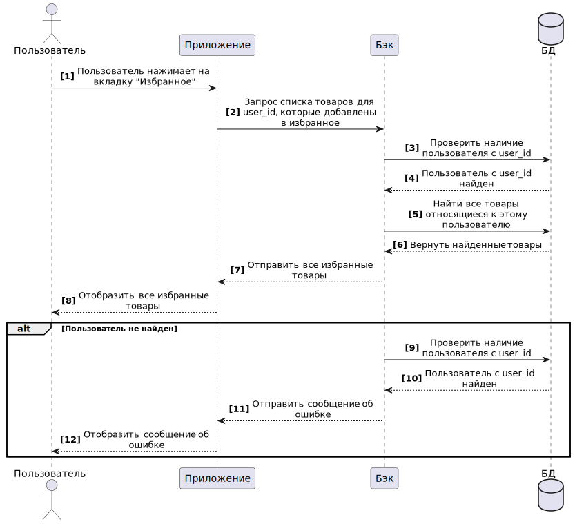

# UML sequence diagram

## Получение списка товаров

| Название                                            | Получение списка товаров                                                                                                                                                                                                                                                                                                                             |
|-----------------------------------------------------|---------------------------------------------------------------------------------------------------------------------------------------------------------------------------------------------------------------------------------------------------------------------------------------------------------------------------------------------------------|
| Краткое описание                                    | Получить список избранных товаров пользователя                                                                                                                                                                                                                                                                       |
| Субъекты                                            | 1. Пользователь 2. FE 3. BE 4. БД                                                                                                                                                                                                                                                                                                                        |
| Предусловие                                         | Пользователь авторизовался в системе Пользователь находится в главном меню                                                                                                                                                                                                                                                                                                                       |
| Основной сценарий                                   | 1. Пользователь нажимает на вкладку N1. 2. FE формирует запрос в BE на вытягивание товаров. 3. BE проверяет наличие пользователя в БД. 1. Если пользователь не найден - AF-1 4. Если пользователь найден, то BE получает все товары относящиеся к этому пользователю, которые добавлены в избранное. 5. BE возвращает ответ FE. 6. FE отображает пользователю все избранные товары относящиеся к нему. Конец сценария.         |
| Альтернативный сценарий                             | AF1: Пользователь не надйен.  1. N3.     2. Пользователь нажимает N3. Конец сценария. 																																					|
| Наименования элементов пользовательского интерфейса | N1: "Избранное"                                                                                                                                                                                                                                                                                                 |
| Диаграмма                                           | { width="100" }                                                                                                                                                                                                                                                                                                         |
